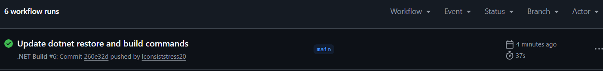

# RaceDay

## System Description

RaceDay is a race event management system designed to manage running events, organisers, participants, race categories, event environments, registrations, and race results.

The system provides a structured database design and planned API endpoints to support the management of race events from creation and registration through to recording and viewing race results.

## User Roles

### Organiser

The Organiser manages race events and their related information. Organisers can create and update events, manage race categories and event environments, manage participant registrations, and record race results.

### Participant

The Participant can register for race events and categories, manage their enrolments, and view their race results.

## Planning Documents

The `/docs` folder contains the main planning and database documents for the RaceDay system:

- Entity Relationship Diagram (ERD)
- API Endpoint Plan
- SQL Database Script

## Database

The SQL database script creates the RaceDay database and its tables, including:

- Users
- Organisers
- Participants
- Events
- Event Environments
- Event Categories
- Event Enrollments
- Results

The database includes primary keys, foreign keys, constraints, default values, and sample data.

## API

The API Endpoint Plan documents the planned REST API endpoints for authentication, users, organisers, events, categories, event environments, enrolments, and results.

## GitHub and CI/CD

GitHub is used for version control and project management.

A GitHub Actions workflow validates the repository structure and checks that the required `docs` folder and SQL script are present.

### Successful CI/CD Build

## Video

An unlisted YouTube video explaining the RaceDay planning documents, ERD decisions, API endpoint plan, and SQL database script is provided below.

YouTube Video: [https://youtu.be/BmGK16-3jpw]